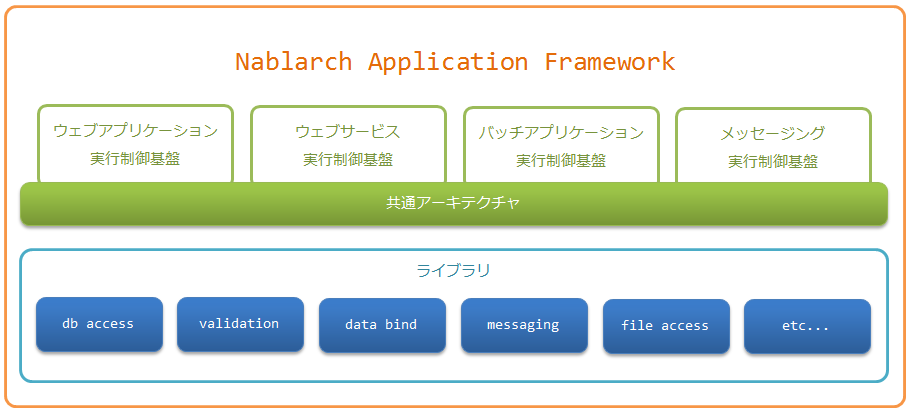

Nablarch vs Spring
---
Nablarchについて

Nablarch(ナブラーク)は、TISの豊富な基幹システム構築経験から得られたナレッジを集約したJavaアプリケーション開発/実行基盤です。
<a href="https://nablarch.github.io/docs/LATEST/doc/" target="_blank">https://nablarch.github.io/docs/LATEST/doc/</a>

---

Nablarchアプリケーションフレームワークは、ウェブやバッチといった処理方式に合わせた実行制御基盤と、 データベースアクセスやバリデーションといった個別の機能を提供するライブラリから構成される。

---
Springについて

Javaプラットフォーム向けのオープンソースアプリケーションフレームワークである。
<a href="https://ja.wikipedia.org/wiki/Spring_Framework" target="_blank">https://ja.wikipedia.org/wiki/Spring_Framework</a>

---?image=http://cdn.springtutorials.com/wp-content/uploads/2016/03/spring-overview-current.png&size=50% 80%

---

NablarchとSpringの共通点
---
### 〇　言語はJava (Spring.NETもあるが、ヒットしない)
---
### 〇　対象は主にWeb Application

---
Web Application以外でも対応：  
    ●　Web Service     
    ●　Batch Application
---
●　Web Service

・Nablarch

RESTfulウェブサービス（推奨）

HTTPメッセージング
<a href="https://nablarch.github.io/docs/LATEST/doc/application_framework/application_framework/web_service/index.html" target="_blank">https://nablarch.github.io/docs/LATEST/doc/application_framework/application_framework/web_service/index.html</a>

---
・Spring

RESTfulウェブサービス（推奨）

<a href="https://spring.io/guides/gs/producing-web-service/" target="_blank">SOAP web service</a>
---
●　Batch Application

・Nablarch

JSR352に準拠したバッチアプリケーション（推奨）

Nablarchバッチアプリケーション

<a href="https://nablarch.github.io/docs/LATEST/doc/application_framework/application_framework/batch/index.html" target="_blank">https://nablarch.github.io/docs/LATEST/doc/application_framework/application_framework/batch/index.html</a>

・Spring

<a href="http://projects.spring.io/spring-batch/" target="_blank">Spring Batch</a>

---

### 〇　MVC

●　<a href="https://nablarch.github.io/docs/LATEST/doc/application_framework/application_framework/web/architecture.html" target="_blank">NablarchもHTTPとServletベースのMVCをサポート</a>

---?image=https://nablarch.github.io/docs/LATEST/doc/_images/web-design.png&size=80% 80%

---

●　自前のMVCフレームワークSpring MVC

HTTPとServletベースで、REST準拠WEBサービスの拡張も可能。（アノテーション設定）

<a href="https://docs.spring.io/spring/docs/current/spring-framework-reference/web.html" target="_blank">https://docs.spring.io/spring/docs/current/spring-framework-reference/web.html</a>

---

### 〇　DBアクセス機能

●　Nablarch

・データベースアクセス(JDBCラッパー)

・ユニバーサルDAO（推奨）
<a href="https://nablarch.github.io/docs/5u8/doc/application_framework/application_framework/libraries/database_management.html" target="_blank">https://nablarch.github.io/docs/5u8/doc/application_framework/application_framework/libraries/database_management.html</a>

●　Spring

・JDBC and DAO

・O/R mapping (JDO, JPA, Hibernate, iBatis)

---

### 〇　トランザクション管理、排他制御

●　Nablarch

・JdbcTransactionFactory 

       <!-- コンポーネントとしてJdbcTransactionFactoryを設定する -->
       <component class="nablarch.core.db.transaction.JdbcTransactionFactory">

  			<!-- アイソレーションレベル -->
  			<property name="isolationLevel" value="READ_COMMITTED" />

  			<!-- トランザクションタイムアウト秒数 -->
  			<property name="transactionTimeoutSec" value="15" />

		</component>

---
●　Spring

・プログラミングによるトランザクション管理

・宣言的トランザクション管理（@Transactional）

---

### 〇　Validation

●　Nablarch

・Java EE7のBean Validation(JSR349)に準拠したバリデーション機能 (Bean Validation)（推奨）

・Nablarch独自のバリデーション機能 (Nablarch Validation)

<a href="https://nablarch.github.io/docs/LATEST/doc/application_framework/application_framework/libraries/validation.html" target="_blank">https://nablarch.github.io/docs/LATEST/doc/application_framework/application_framework/libraries/validation.html</a>

●　Spring
・Java EE7のBean Validation(JSR349)に準拠したバリデーション機能 (Bean Validation)

・Custom Validator

---
### 〇　セッション管理

●　Nablarch
セッション変数の保存先は以下３つ

・DBストア

・HIDDENストア

・HTTPセッションストア

---?image=https://nablarch.github.io/docs/LATEST/doc/_images/session_store.png&size=80% 80%

---

1.セッション変数保存ハンドラ の往路処理で、クッキーから取得したセッションIDをもとに、セッションストアからセッション変数をロードする。

2.業務アクションから SessionUtil を通して、セッション変数に対する読み書きを行う。

3.セッション変数保存ハンドラ の復路処理で、セッション変数をセッションストアに保存する。

4.JSPで参照できるように、セッション変数をリクエストスコープに設定する。(既にリクエストスコープに同名の値が存在する場合は設定しない。)

---

●　Spring

・ユーザーセッションを管理するAPIとその実装（例えばRedis）を提供する

・HttpSession - アプリケーションコンテナ（例えばTomcat）のHttpSessionに仲介する形でその機能を置き換える。

・クラスターセッション - アプリケーションコンテナ固有の問題に縛られることなく、クラスタリングされたセッションをサポートすることができる

・複数セッション - 1つのブラウザで複数のユーザーセッションを管理することができる。

---

・RESTful API - RESTfulなAPIでも動作するようにセッションIDをHTTPヘッダで提供できる

・WebSocket - WebSocketでメッセージを受け取ったときもHttpSessionを有効にし続ける機能を提供する

<a href="https://projects.spring.io/spring-session/" target="_blank">https://projects.spring.io/spring-session/</a>

---

### 〇　ログ出力

●　Nablarch

ログ出力は、３つの処理から構成されており、それぞれの実装を差し替えることができる。
---?image=https://nablarch.github.io/docs/LATEST/doc/_images/log-structure.png&size=80% 80%

---

デフォルトクラス

Logger/LoggerFactory

・BasicLogger

・BasicLoggerFactory

---
LogWriter

・FileLogWriter (ファイルへ出力。ファイルサイズによるローテーション)

・SynchronousFileLogWriter (複数プロセスから1ファイルへの出力)

・StandardOutputLogWriter (標準出力へ出力)

LogFormatter

・BasicLogFormatter (パターン文字列によるフォーマット)

---

ほかはlogアダプタを使って、log4jなどに委譲するのも可能

<a href="https://nablarch.github.io/docs/LATEST/doc/application_framework/adaptors/log_adaptor.html#log-adaptor" target="_blank">https://nablarch.github.io/docs/LATEST/doc/application_framework/adaptors/log_adaptor.html#log-adaptor</a>

---

ログの種類

・障害通知ログ

・障害解析ログ

・SQLログ

・パフォーマンスログ

・HTTPアクセスログ

・メッセージングログ

<a href="https://nablarch.github.io/docs/LATEST/doc/application_framework/application_framework/libraries/log.html" target="_blank">https://nablarch.github.io/docs/LATEST/doc/application_framework/application_framework/libraries/log.html</a>

---

●　Spring

・Java Util Logging

・Log4J

・Log4J2

・Logback

・SLF4J

現在はlogback + SLF4J または log4j2 + SLF4Jという組み合わせの２強

---

### 〇　テストフレームワーク

●　Nablarch

・JUnit4ベース

・テストデータの外部化（Excelファイルに記述）

・Nablarchに特化したテスト補助機能

---?image=https://nablarch.github.io/docs/LATEST/doc/_images/abstract_structure.png&size=80% 80%
---

おまけ：リクエスト単体データ作成ツール

・HTML画面操作で操作でテストデータを作成

<a href="https://nablarch.github.io/docs/LATEST/doc/development_tools/testing_framework/guide/development_guide/08_TestTools/01_HttpDumpTool/01_HttpDumpTool.html" target="_blank">https://nablarch.github.io/docs/LATEST/doc/development_tools/testing_framework/guide/development_guide/08_TestTools/01_HttpDumpTool/01_HttpDumpTool.html</a>

---

●　Spring

・JUnitかTestNG

・mock objects

・annotations
 
<a href="https://docs.spring.io/spring/docs/current/spring-framework-reference/testing.html#integration-testing-annotations" target="_blank">https://docs.spring.io/spring/docs/current/spring-framework-reference/testing.html#integration-testing-annotations</a>

---

### 〇　メッセージング

●　Nablarch

・MOMによるメッセージング

・テーブルをキューとして使ったメッセージング

<a href="https://nablarch.github.io/docs/LATEST/doc/application_framework/application_framework/messaging/index.html" target="_blank">https://nablarch.github.io/docs/LATEST/doc/application_framework/application_framework/messaging/index.html</a>

---
●　Spring

・spring-jms  :   JMSを利用したメッセージング機能

・Advanced Message Queuing Protocol (AMQP) 

---

### 〇　メール送信

●　Nablarch

ディレードオンライン処理と呼ばれる方式を採用しており、 メール送信を即時に行うのではなく、

一旦、メール送信要求をデータベースに格納しておき、 常駐バッチを使い非同期にメール送信を行う。

---?image=https://nablarch.github.io/docs/LATEST/doc/_images/mail_system.png
---

●　Spring

JavaMailSender API

---
### 〇　ライセンス

両者ともApache License 2.0
 
---
### 〇　サポート/コミュニティ

●　Nablarch

・主に日本語

・小規模

●　Spring

・主に英語

・大規模

--- 

### 〇　使えるIDE

・IntelliJ 

・Eclipse

---

### Nablarchの特色

●　UIコンポーネント
  
  独自のUI開発基盤を持つ。設計段階に作成したデモ用JSPファイルはそのまま開発段階に流用できる。
  
  JSPファイルの様式は既定のUI基準に準拠したものであり、開発者はそれを意識する必要がない。
  
●　ETL機能

●　レポート出力ライブラリ

●　ワークフローライブラリ

---

### Springの特色

●　DIコンテナ(Dependency Injection)

---?image=https://thinkit.co.jp/images/compare/13/2/2.gif

---
メリット

・疎結合

・テストしやすくなる

---

●　AOP(Aspect Oriented Programming)

クラスには「本質的な処理」のみ記述し、
「本質的ではない余計な処理（共通化出来る処理）」をアスペクトに記述

---?image=https://qiita-image-store.s3.amazonaws.com/0/124833/7a52d2bb-cc42-d60d-1e84-db709a1a6263.png&size=80% 80%

---

よく使う場面

・トランザクション管理

・ログ出力

・例外管理

