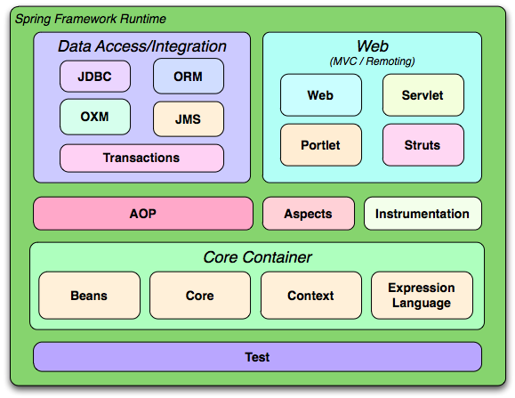

Nablarch vs Spring
---
Nablarchについて

Nablarch(ナブラーク)は、TISの豊富な基幹システム構築経験から得られたナレッジを集約したJavaアプリケーション開発/実行基盤です。
<a href="https://nablarch.github.io/docs/LATEST/doc/" target="_blank">https://nablarch.github.io/docs/LATEST/doc/</a>

+++

Nablarchアプリケーションフレームワークは、ウェブやバッチといった処理方式に合わせた実行制御基盤と、 データベースアクセスやバリデーションといった個別の機能を提供するライブラリから構成される。

---
Springについて

Javaプラットフォーム向けのオープンソースアプリケーションフレームワークである。
<a href="https://ja.wikipedia.org/wiki/Spring_Framework" target="_blank">https://ja.wikipedia.org/wiki/Spring_Framework</a>

+++

---

NablarchとSpringの共通点
---
1. 言語はJava (Spring.NETもあるが、ヒットしない)
---
2. 対象は主にWebベースのアプリケーション。   
   Web以外も対応：  
    ●Web Service     
     ・Nablarchでは、以下2種類のウェブサービス用のフレームワークを提供している。
     
         RESTfulウェブサービス（推奨）      
         HTTPメッセージング
         
                     
         
      ・
---

